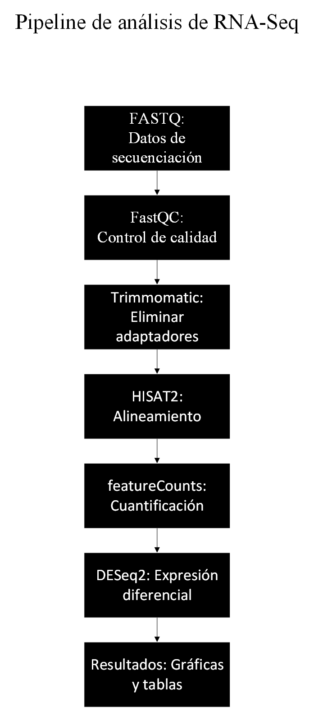

# Equipo-B00
Repositorio del equipo para el desarrollo de actividades de Bioinformática enfocadas en el análisis de expresión génica mediante RNA-Seq.

# Análisis de expresión génica mediante RNA-Seq
## Descripción

Este proyecto tiene como objetivo analizar secuencias de RNA (RNA-Seq) como expresión génica de un conjunto de muestras biológicas.

## Objetivos

-Organizar los datos de entrada.
-Procesar archivos de Rna-Seq.
-Analizar la expresión génica.
-Obtener resultados reproducibles.

## Estructura del proyecto

- **data/**: Datos de entrada.
- **scripts/**: Scripts de análisis.
- **results/**: Resultados obtenidos.
- **docs/**: Documentación del proyecto.
- **figures/**: Diagramas e imagenes del proyecto.

## Pipeline de análisis

- El siguiente diagrama resume el flujo general del análisis de RNA-Seq empleado en este proyecto.

## Requisitos

- Git
- R (versión 4.0 o superior)
- RStudio
- FastQC
- HISAT2
- DESeq2
  
## Autor José Andrés Zertuche
## Autor Diana Alejandra Rubio Delgado

## Licencia
Mozilla Public License 2.0

